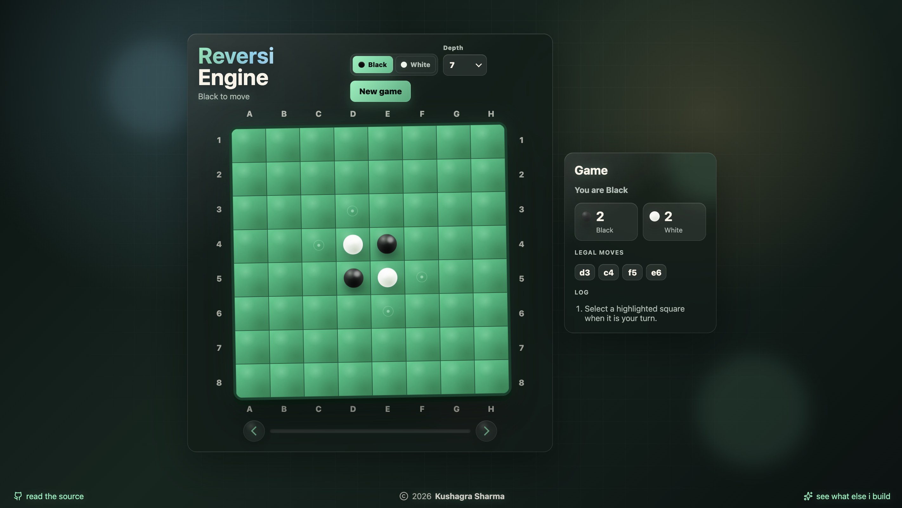

# Reversi (Othello) Engine

[](https://www.rust-lang.org/)      [](LICENSE)



a reversi engine written in rust.

the board is represented with two `u64` bitboards, one for black and one for white. move generation uses directional bit shifts with edge masks to avoid wraparound across files.

the search is negamax with alpha beta pruning. `best_move` uses iterative deepening and keeps the best move from the previous depth around for move ordering. there is also a basic transposition table keyed by the black and white bitboards.

the evaluation function changes by game phase:

- early game: mobility and avoiding bad corner-adjacent squares
- middle game: mobility, corners, and stable edge/corner discs
- late game: corners, stability, and disc count

## running it

terminal:

```bash
cargo run
```

browser:

```bash
cargo run --bin web
```

then open:

```text
http://127.0.0.1:8080
```

tests:

```bash
cargo test
```

## notes

the default ai depth is 7.

the web version uses the same rust engine through a small local http server. it also has side selection, depth selection, and move history viewing.

## license

mit.
